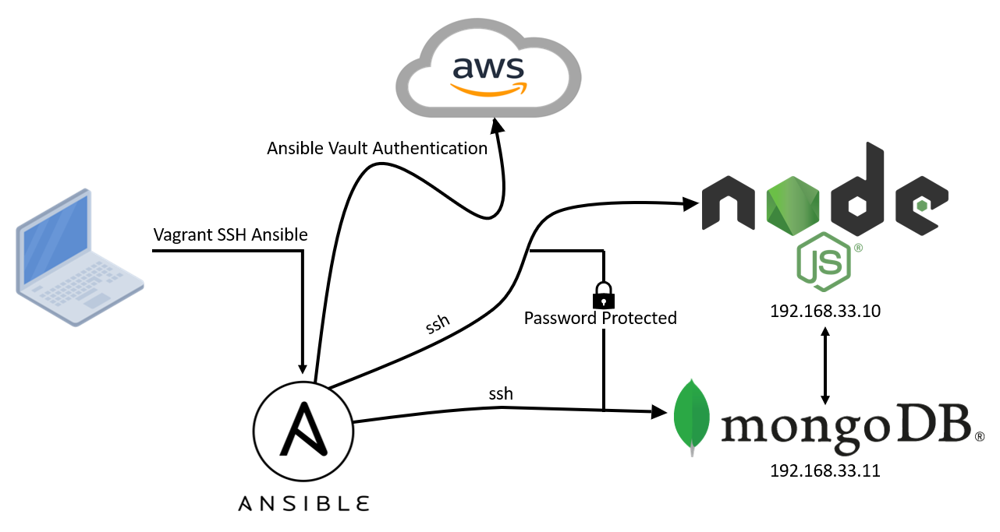

# IAC with Ansible


## Table Of Contents

## Creating A Vagrantfile For Three VMs For Ansible architecture
### Ansible controller and Ansible agents 
```

# -*- mode: ruby -*-
 # vi: set ft=ruby :
 
 # All Vagrant configuration is done below. The "2" in Vagrant.configure
 # configures the configuration version (we support older styles for
 # backwards compatibility). Please don't change it unless you know what
 
 # MULTI SERVER/VMs environment 
 #
 Vagrant.configure("2") do |config|
 # creating are Ansible controller
   config.vm.define "controller" do |controller|
     
    controller.vm.box = "bento/ubuntu-18.04"
    
    controller.vm.hostname = 'controller'
    
    controller.vm.network :private_network, ip: "192.168.33.12"
    
    # config.hostsupdater.aliases = ["development.controller"] 
    
   end 
 # creating first VM called web  
   config.vm.define "web" do |web|
     
     web.vm.box = "bento/ubuntu-18.04"
    # downloading ubuntu 18.04 image
 
     web.vm.hostname = 'web'
     # assigning host name to the VM
     
     web.vm.network :private_network, ip: "192.168.33.10"
     #   assigning private IP
     
     #config.hostsupdater.aliases = ["development.web"]
     # creating a link called development.web so we can access web page with this link instread of an IP   
         
   end
   
 # creating second VM called db
   config.vm.define "db" do |db|
     
     db.vm.box = "bento/ubuntu-18.04"
     
     db.vm.hostname = 'db'
     
     db.vm.network :private_network, ip: "192.168.33.11"
     
     #config.hostsupdater.aliases = ["development.db"]     
   end
 
 
 end
```

## Infrastructure as Code (IaC)
### Ansible & Terraform
- Configuration Management
- Orchestration
- Push Config - Ansible To Push To Config
- Terraform For Orchestration
- Ansible YAML/YML file.yml/yaml
- Ansible:
  - Simple
  - Agentless


## Run Three Virutal Machines
- `vagrant up` the vagrant file which should boot up three virutal machines. First one called `controller`, second being `web` and the last one being `db`.
- After this is done you can use `vagrant status` to see if they are all actually running
- Once they are all running `ssh` into each one of them and use the update and upgrade commands to see if they are connected to the internet `sudo apt-get update -y` and `sudo apt-get upgrade -y`

### Setting Up Ansible Controller
- Install required dependencies:
  - Python `sudo apt-get install software-properties-common`
  - Ansible `sudo apt-add-repository ppa:ansible/ansible` , `sudo apt-get install ansible -y`, `ansible --version`
  - Tree `sudo apt install tree`
- set up the agent nodes 
- default folder structures /etc/ansible/hosts
- hosts file - agent node called web IP of the web
- in /etc/ansible/hosts add
```
[web]
192.168.33.10 ansible_connection=ssh ansible_ssh_user=vagrant ansible_ssh_pass=vagrant
[db]
192.168.33.10 ansible_connection=ssh ansible_ssh_user=vagrant ansible_ssh_pass=vagrant
```
- `ssh vagrant@192.168.33.10`, `ssh vagrant@192.168.33.11`
- See free storage `ansible all -a "free"`
- copy file from one place to the other `ansible web -m copy -a "src=/etc/ansible/readme.md dest=/home/vagrant/readme.md"`